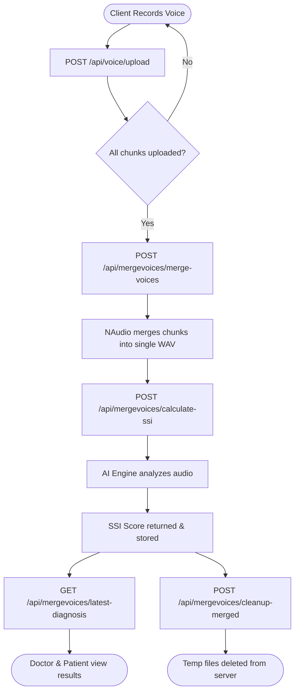

<h1>
  
  SPEAK Backend Platform
</h1>

[](https://dotnet.microsoft.com/)
[](https://docs.microsoft.com/en-us/ef/core/)
[](https://www.microsoft.com/sql-server)
[](https://dotnet.microsoft.com/apps/aspnet/signalr)
[](https://redis.io/)

> A highly scalable REST API functioning as the core orchestration engine for the **SPEAK ecosystem**.
> The platform connects parents and phoniatricians (speech-language physicians), enabling the monitoring, diagnosis, and tracking of speech disorders such as stuttering through advanced audio processing and real-time communication.

---

## 🌐 Live Deployment & Ecosystem Integrations

The API is fully deployed and actively hosted in a production environment via **MonsterASP.NET**. It serves as the central hub of the SPEAK ecosystem, seamlessly integrating with two major external components:

1. **Cross-Platform Mobile Application**: The primary client interface for parents and doctors, communicating directly with this live server via REST endpoints and SignalR real-time sockets.
2. **AI Processing Engine**: A dedicated artificial intelligence microservice that securely receives the orchestrated audio streams from this backend to perform advanced stuttering analysis and return the SSI evaluation.

> **Live Swagger UI:** [http://speakapp.runasp.net/swagger/index.html](http://speakapp.runasp.net/swagger/index.html) — Browse and test all available API endpoints interactively.

---

## 🏗️ System Architecture

The project is structured around the **Onion Architecture** (Clean Architecture) paradigm. This strictly isolates the core domain model and business rules from external infrastructure, databases, and UI concerns, ensuring long-term maintainability and separation of concerns.


### Layer Breakdown

- **Domain Layer (`Core/SPEAK.Domain`)** — The innermost layer. Pure C# business entities (`ApplicationUser`, `DiagnosticRecord`, `Message`) with zero external framework dependencies.
- **Abstraction Layer (`Core/SPEAK.Abstraction`)** — Defines all service & repository interfaces: `IAuthenticationServices`, `IDoctorRepository`, `IVoiceProcessingService`, etc.
- **Service Layer (`Core/SPEAK.Service`)** — Implements the business logic: coordinates audio processing, orchestrates diagnostic SSI calculations, and handles email flows via MailKit.
- **Infrastructure Layer (`Infrastructure/SPEAK.Persistence`)** — Entity Framework Core `DbContext`, entity configurations, migrations, and repository implementations.
- **Presentation Layer (`SPEAK.Web` & `SPEAK.Dashboard`)** — `SPEAK.Web` exposes all RESTful endpoints and the SignalR `ChatHub`. `SPEAK.Dashboard` is the MVC admin panel.

---

## 🛠️ Technical Stack & Libraries

| Category | Technology | Purpose |
|----------|------------|---------|
| **Core Framework** | `.NET 9.0` | High-performance foundational API framework |
| **Database & ORM** | `SQL Server` & `EF Core 9` | Relational data persistence and schema migrations |
| **Authentication** | `ASP.NET Core Identity` & `JWT` | Stateless user authentication and RBAC |
| **Real-Time Chat** | `SignalR` & `WebRTC` | Low-latency bidirectional messaging and video calls |
| **Audio Processing** | `NAudio.Core` | Parsing, segmenting, and merging chunked `.wav` files |
| **Email Services** | `MailKit` | Reliable delivery of OTPs and verification emails |
| **Caching** | `StackExchange.Redis` | Distributed caching and SignalR scale-out backplane |
| **API Docs** | `Swashbuckle` | Interactive Swagger / OpenAPI endpoint documentation |

---

## 🔄 Core Capabilities

### 1. Identity & Access Management

A stateless **JWT-based** authentication system secured via `ASP.NET Core Identity`. The system enforces **Role-Based Access Control (RBAC)** with distinct, isolated permissions for `Patient`, `Doctor`, and `Admin` roles.

- **Google OAuth:** Patients and doctors can sign in via Google. New Google users are issued a temporary profile-completion token before full JWT issuance.
- **Doctor Registration:** Doctors upload Syndicate Card and National ID images during a dedicated registration flow, which are then reviewed by admins through the dashboard.

---

### 2. Clinical Audio & Diagnostics Pipeline

The backbone of the platform. The API orchestrates the full lifecycle of a voice recording session to produce a clinical SSI score.



---

### 3. Real-Time Chat & WebRTC Video Calls

The `ChatHub` (SignalR) is the engine behind all real-time interactions. It supports **text messaging with delivery/read receipts**, **media file sharing**, and **full WebRTC video/audio calling** with ICE candidate negotiation.

**Connection URL:** `wss://speakapp.runasp.net/chatHub`

---

### 4. Doctor Verification & Admin Dashboard

A dedicated **MVC Admin Dashboard** (`SPEAK.Dashboard`) provides platform administrators with a web interface to:
- Review uploaded doctor credentials (Syndicate Card, National ID).
- Approve or reject doctor registrations.
- Enable or disable user accounts.
- View system-level audit logs.

---

### 5. AI Chatbot Integration

An integrated chatbot controller that proxies requests to the AI microservice. It supports standard request/response chat, **streaming responses (SSE)**, **voice-to-text**, and **voice-to-voice** interactions.

---

## 🔌 API Reference

**Base URL:** `http://speakapp.runasp.net/api`
**SignalR Hub:** `wss://speakapp.runasp.net/chatHub`

> All protected endpoints require: `Authorization: Bearer {jwt_token}`

---

### Authentication (`/api/authentication`)

| Method | Endpoint | Description | Auth |
|--------|----------|-------------|------|
| `POST` | `/login` | Login with email & password, returns JWT | No |
| `POST` | `/register` | Register a new patient account | No |
| `POST` | `/verify-registration-otp` | Verify email OTP after registration | No |
| `POST` | `/resend-registration-otp` | Resend registration OTP email | No |
| `GET` | `/checkEmail` | Check if an email is already in use | No |
| `POST` | `/forget-password` | Initiate password reset, sends OTP | No |
| `POST` | `/verify-otp` | Verify password reset OTP | No |
| `POST` | `/reset-password` | Set new password after OTP verification | No |
| `POST` | `/login-google` | Authenticate via Google OAuth token | No |
| `POST` | `/complete-google-profile` | Complete profile for new Google OAuth users | No |
| `POST` | `/register-doctor` | Register a new doctor with credential uploads | No |
| `GET` | `/profile` | Retrieve current authenticated user's profile | Yes |
| `PUT` | `/profile` | Update current user's profile information | Yes |
| `PUT` | `/change-password` | Change authenticated user's password | Yes |
| `POST` | `/logout` | Logout and invalidate the current session | Yes |

---

### Voice & Diagnostics

#### Voice Upload (`/api/voice`)
| Method | Endpoint | Description | Auth |
|--------|----------|-------------|------|
| `POST` | `/upload` | Upload a single WAV audio chunk | Yes |

#### Merge & Diagnostics (`/api/mergevoices`)
| Method | Endpoint | Description | Auth |
|--------|----------|-------------|------|
| `POST` | `/merge-voices` | Merge all uploaded voice chunks into one file | Yes |
| `POST` | `/calculate-ssi` | Send merged audio to AI Engine and store SSI result | Yes |
| `GET` | `/latest-diagnosis` | Retrieve the most recent diagnostic SSI result | Yes |
| `POST` | `/cleanup-merged` | Delete temporary merged audio files from storage | Yes |

---

### Real-Time Chat (`/api/chat`)
| Method | Endpoint | Description | Auth |
|--------|----------|-------------|------|
| `GET` | `/doctors` | Get list of doctors available to chat with | Yes |
| `GET` | `/history/{otherUserId}` | Retrieve full message history with a specific user | Yes |
| `GET` | `/conversations` | Get all recent conversation threads | Yes |

#### Chat Media (`/api/chatmedia`)
| Method | Endpoint | Description | Auth |
|--------|----------|-------------|------|
| `POST` | `/upload` | Upload a media file (image/video) for chat sharing | Yes |

---

### AI Chatbot (`/api/chatbot`)
| Method | Endpoint | Description | Auth |
|--------|----------|-------------|------|
| `POST` | `/chat` | Send a text message to the AI assistant | Yes |
| `POST` | `/chat-stream` | Streaming AI response via SSE | Yes |
| `POST` | `/voice-to-text` | Convert a voice recording to text via AI | Yes |
| `POST` | `/voice-to-voice` | Send voice, receive voice response from AI | Yes |

---

### Admin (`/api/admin`)
> All endpoints require `Admin` role.

| Method | Endpoint | Description |
|--------|----------|-------------|
| `GET` | `/pending-doctors` | List all doctors awaiting verification |
| `GET` | `/all-doctors` | List all registered doctors |
| `POST` | `/approve-doctor` | Approve a doctor's registration |
| `POST` | `/reject-doctor` | Reject a doctor's registration |
| `POST` | `/disable-user/{userId}` | Disable a user account |
| `POST` | `/enable-user/{userId}` | Re-enable a disabled user account |
| `GET` | `/logs` | View system audit logs |

---

## 💬 SignalR Hub Reference

**Hub URL:** `wss://speakapp.runasp.net/chatHub`
**Authentication:** Pass JWT via `access_token` query parameter or `Authorization` header.

### Client → Server (Invoke)

| Method | Parameters | Description |
|--------|-----------|-------------|
| `SendMessage` | `SendMessageDto` | Send a chat message to another user |
| `MarkAsRead` | `senderId: string` | Mark messages from a sender as read |
| `MarkAsDelivered` | `senderId: string` | Mark messages from a sender as delivered |
| `CallUser` | `receiverId, sdpOffer, isVideo` | Initiate a WebRTC call |
| `AnswerCall` | `callerId, sdpAnswer` | Accept an incoming WebRTC call |
| `SendIceCandidate` | `targetUserId, candidate, sdpMid, sdpMLineIndex` | Exchange ICE candidates for WebRTC negotiation |
| `EndCall` | `targetUserId: string` | Terminate an active call |
| `RejectCall` | `callerId: string` | Reject an incoming call |

### Server → Client (Listen)

| Event | Payload | Description |
|-------|---------|-------------|
| `ReceiveMessage` | `MessageDto` | A new message was received |
| `MessagesRead` | `readByUserId: string` | Your messages were marked as read |
| `MessagesDelivered` | `deliveredToUserId: string` | Your messages were delivered |
| `IncomingCall` | `callerId, sdpOffer, isVideo` | Another user is calling you |
| `CallAnswered` | `receiverId, sdpAnswer` | Your call was answered |
| `ReceiveIceCandidate` | `senderId, candidate, sdpMid, sdpMLineIndex` | ICE candidate for WebRTC negotiation |
| `CallEnded` | `userId: string` | The active call was terminated |
| `CallRejected` | `userId: string` | Your call was rejected |

---

## ⚙️ Local Setup

### Prerequisites
- **.NET 9 SDK**
- **SQL Server** (Developer Edition or Docker)
- **Redis** (for caching and SignalR scale-out)

### Configuration

Update `appsettings.json` in `SPEAK.Web` and `SPEAK.Dashboard`:

```json
{
  "ConnectionStrings": {
    "DefaultConnection": "Server=.;Database=SpeakDb;Trusted_Connection=True;"
  },
  "JwtSettings": {
    "Key": "your-super-secret-key-min-32-chars",
    "Issuer": "SPEAKApi",
    "Audience": "SPEAKClient",
    "DurationInMinutes": 1440
  }
}
```

### Apply Database Migrations

```bash
cd SPEAK.Web
dotnet ef database update --project ../Infrastructure/SPEAK.Persistence
```

### Run the Application

```bash
# API
cd SPEAK.Web && dotnet run

# Admin Dashboard
cd SPEAK.Dashboard && dotnet run
```

**Swagger UI:** `https://localhost:{port}/swagger`

---

## 🔐 Authentication

All protected API endpoints require a valid JWT in the `Authorization` header:

```
Authorization: Bearer {your_jwt_token}
```

For the SignalR hub, pass the token via query string:

```
wss://speakapp.runasp.net/chatHub?access_token={your_jwt_token}
```
