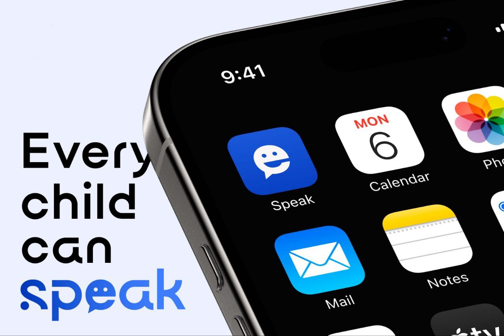
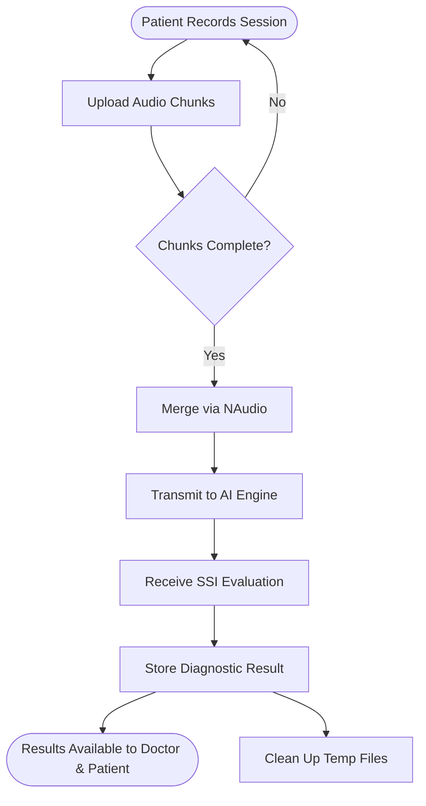

<h1>SPEAK : Stuttering Diagnosis and Treatment Platform (Backend)</h1>

[](https://dotnet.microsoft.com/)
[](https://docs.microsoft.com/en-us/ef/core/)
[](https://www.microsoft.com/sql-server)
[](https://dotnet.microsoft.com/apps/aspnet/signalr)
[](https://redis.io/)
[]()
[]()
[]()

> 
> 
> **SPEAK is an innovative healthcare platform dedicated to assisting children who stutter by providing a comprehensive ecosystem for diagnosis, treatment, and continuous tracking.**
> 
> This repository houses the robust, high-performance REST API acting as the central nervous system for the platform. It seamlessly links parents with phoniatricians (speech-language physicians), facilitating real-time communication and sophisticated AI-driven audio processing to calculate Stuttering Severity Instrument (SSI) scores.

<br clear="all"/>

---

## 🚀 Deployment & Ecosystem

The SPEAK backend is fully operational and hosted live on **MonsterASP.NET**. It acts as the core orchestrator, integrating heavily with two main client-facing systems:

- 📱 **Mobile Client App:** The main interface used by both parents and physicians. It communicates with this server via REST for standard operations and SignalR for real-time interactions.
- 🧠 **AI Analytics Microservice:** A specialized AI engine that receives audio data from our backend, performs deep stuttering analysis, and returns the **Stuttering Severity Instrument (SSI)** score.

> **Explore the API:** [http://speakapp.runasp.net/swagger/index.html](http://speakapp.runasp.net/swagger/index.html) — Interactive Swagger UI to test endpoints.

---

## 🧩 Architecture Overview

We implemented a strict **Clean Architecture (Onion)** pattern to ensure separation of concerns. This design guarantees that our core business rules remain completely isolated from databases, UI, or external frameworks.

### Structural Layers

1. **Domain Layer** (`Core/SPEAK.Domain`) — The heart of the system containing pure C# entities (`ApplicationUser`, `DiagnosticRecord`, `Message`). No external dependencies.
2. **Abstraction Layer** (`Core/SPEAK.Abstraction`) — Interfaces defining repository and service contracts (`IAuthenticationServices`, `IDoctorRepository`).
3. **Service Layer** (`Core/SPEAK.Service`) — Business logic implementation. Handles audio processing orchestration, diagnostic flows, and email notifications.
4. **Infrastructure Layer** (`Infrastructure/SPEAK.Persistence`) — Data access layer utilizing **Entity Framework Core** (`DbContext`, migrations, repositories).
5. **Presentation Layer** (`SPEAK.Web` & `SPEAK.Dashboard`) — The presentation endpoints. `SPEAK.Web` houses the REST API and SignalR hubs, while `SPEAK.Dashboard` provides an MVC-based admin panel.

---

## 💻 Technology Stack

- **Framework:** `.NET 9.0`
- **Database:** `SQL Server` via `EF Core 9`
- **Auth:** `ASP.NET Core Identity` paired with stateless `JWT` tokens
- **Real-Time & Calls:** `SignalR` alongside `WebRTC`
- **Audio Manipulation:** `NAudio.Core` (for handling `.wav` chunking and merging)
- **Email Delivery:** `MailKit`
- **Caching Engine:** `StackExchange.Redis`
- **Documentation:** `Swashbuckle` (Swagger)

---

## ⚡ Key Features

### 🔐 Identity & Security
A fully stateless **JWT auth flow** backed by `ASP.NET Core Identity`, enforcing strict **Role-Based Access Control (RBAC)** across `Patient`, `Doctor`, and `Admin` tiers.
- Supports traditional Email/Password with **OTP verification**.
- Integrated **Google OAuth** for quick onboarding.
- Specialized doctor registration requiring uploads of official credentials (Syndicate Card & National ID) for manual admin review.

### 🎙️ Audio Diagnostics Pipeline
The primary flow for analyzing patient speech. The server handles the entire lifecycle of a recording session to generate a clinical SSI score.



### 💬 Real-Time Communications
Powered by SignalR, our `ChatHub` manages instant messaging with **read/delivery receipts**, media sharing, and handles the complex signaling required for peer-to-peer **WebRTC audio/video calls**.

### 🛡️ Administrative Dashboard
An **MVC panel** providing platform admins the tools to review doctor credentials, approve/reject registrations, toggle user account status, and monitor system activity logs.

### 🤖 AI Assistant
A built-in proxy controller communicating with our AI service to offer standard chat, streaming responses via **Server-Sent Events (SSE)**, **voice-to-text**, and **voice-to-voice** capabilities.

---

## 📚 RESTful API Endpoints

**Base URI:** `http://speakapp.runasp.net/api`
*(Include `Authorization: Bearer <token>` for protected routes)*

### Auth Endpoints (`/api/authentication`)
- **`POST`** `/login` - Issue JWT token.
- **`POST`** `/register` - Register patient.
- **`POST`** `/register-doctor` - Register physician (requires image uploads).
- **`POST`** `/verify-registration-otp` - Verify email.
- **`POST`** `/forget-password` / `/verify-otp` / `/reset-password` - Password recovery flow.
- **`POST`** `/login-google` / `/complete-google-profile` - OAuth flow.
- **`GET`** `/profile` / **`PUT`** `/profile` - Manage account info.
- **`PUT`** `/change-password` / **`POST`** `/logout` - Session management.

### Diagnostics & Audio (`/api/voice` & `/api/mergevoices`)
- **`POST`** `/voice/upload` - Receive `.wav` chunks.
- **`POST`** `/mergevoices/merge-voices` - Combine chunks.
- **`POST`** `/mergevoices/calculate-ssi` - Trigger AI analysis.
- **`GET`** `/mergevoices/latest-diagnosis` - Fetch results.
- **`POST`** `/mergevoices/cleanup-merged` - Remove temporary files.

### Messaging (`/api/chat` & `/api/chatmedia`)
- **`GET`** `/chat/doctors` - List available physicians.
- **`GET`** `/chat/conversations` - Active threads.
- **`GET`** `/chat/history/{userId}` - Direct message history.
- **`POST`** `/chatmedia/upload` - Share images/videos in chat.

### Chatbot (`/api/chatbot`)
- **`POST`** `/chat` & `/chat-stream` - Text-based AI interaction.
- **`POST`** `/voice-to-text` & `/voice-to-voice` - Audio-based AI interaction.

### Administrator (`/api/admin`)
- **`GET`** `/pending-doctors` / **`GET`** `/all-doctors` - View physician statuses.
- **`POST`** `/approve-doctor` / **`POST`** `/reject-doctor` - Manage approvals.
- **`POST`** `/disable-user/{userId}` / **`POST`** `/enable-user/{userId}` - Account toggles.

---

## 📡 Real-Time Sockets (SignalR)

**Endpoint:** `wss://speakapp.runasp.net/chatHub?access_token=<token>`

**Methods Invoked by Client:**
- `SendMessage(dto)` - Send text/media.
- `MarkAsRead(senderId)` / `MarkAsDelivered(senderId)` - Message status updates.
- `CallUser`, `AnswerCall`, `SendIceCandidate`, `EndCall`, `RejectCall` - WebRTC signaling.

**Events Listened by Client:**
- `ReceiveMessage`
- `MessagesRead` / `MessagesDelivered`
- `IncomingCall` / `CallAnswered` / `ReceiveIceCandidate` / `CallEnded` / `CallRejected`

---

## ⚙️ Development Setup

**Requirements:** .NET 9 SDK, SQL Server, Redis.

1. **Configure Settings:** Update `ConnectionStrings` and `JwtSettings` in `appsettings.json`.
2. **Apply Migrations:**
   ```bash
   cd SPEAK.Web
   dotnet ef database update --project ../Infrastructure/SPEAK.Persistence
   ```
3. **Launch:**
   ```bash
   cd SPEAK.Web && dotnet run
   ```
   *Access Swagger at `https://localhost:<port>/swagger`*
